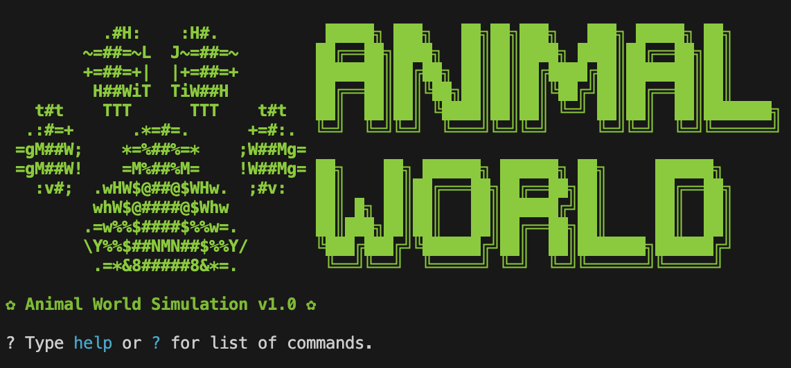
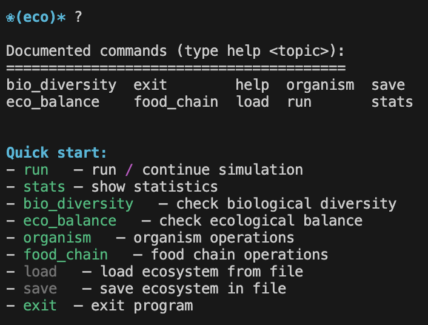
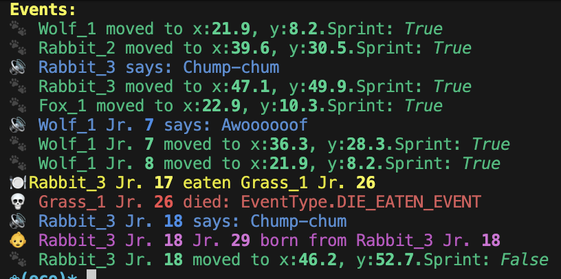
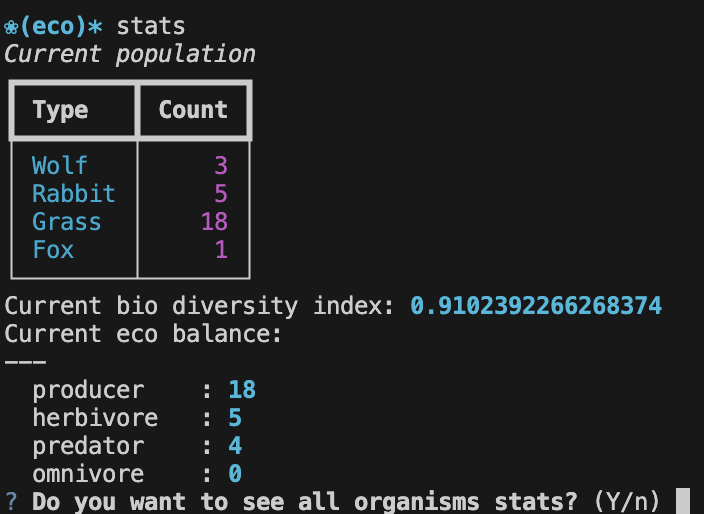
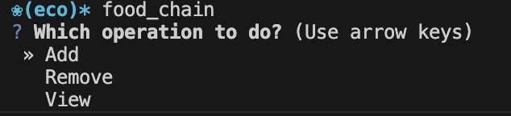
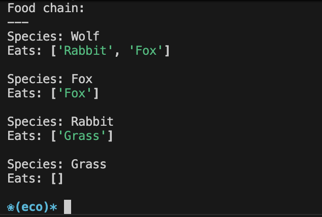
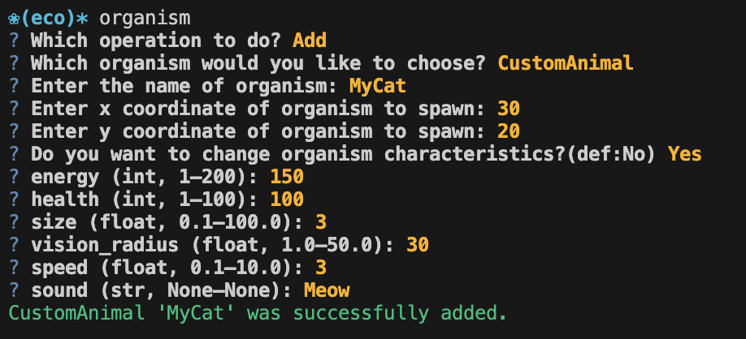

# 🐾 Animal world (Ecosystem) model

## 🏁 Intro

```text
                                                        
            .#H:    :H#.             █████╗ ███╗   ██╗██╗███╗   ███╗ █████╗ ██╗
          ~=##=~L  J~=##=~          ██╔══██╗████╗  ██║██║████╗ ████║██╔══██╗██║
          +=##=+|  |+=##=+          ███████║██╔██╗ ██║██║██╔████╔██║███████║██║
           H##WiT  TiW##H           ██╔══██║██║╚██╗██║██║██║╚██╔╝██║██╔══██║██║
     t#t    TTT      TTT    t#t     ██║  ██║██║ ╚████║██║██║ ╚═╝ ██║██║  ██║███████╗
    .:#=+      .*=#=.      +=#:.    ╚═╝  ╚═╝╚═╝  ╚═══╝╚═╝╚═╝     ╚═╝╚═╝  ╚═╝╚══════╝
   =gM##W;    *=%##%=*    ;W##Mg=  
   =gM##W!    =M%##%M=    !W##Mg=   ██╗    ██╗ ██████╗ ██████╗ ██╗     ██████╗
     :v#;  .wHW$@##@$WHw.  ;#v:     ██║    ██║██╔═══██╗██╔══██╗██║     ██╔══██╗
           whW$@####@$Whw           ██║ █╗ ██║██║   ██║██████╔╝██║     ██║  ██║
          .=w%%$####$%%w=.          ██║███╗██║██║   ██║██╔══██╗██║     ██║  ██║
          \Y%%$##NMN##$%%Y/         ╚███╔███╔╝╚██████╔╝██║  ██║███████╗██████╔╝
           .=*&8#####8&*=.           ╚══╝╚══╝  ╚═════╝ ╚═╝  ╚═╝╚══════╝╚═════╝
                
```


[](https://rich.readthedocs.io/)
[](https://pypi.org/project/questionary/)
> Interactive ecosystem simulation: organisms hunt, eat, reproduce, age and die — step by step, right in your terminal. v0.6.2
## ⚙️ Installation & Running

### Requirements

- Python **3.9+**
- Dependencies listed in `requirements.txt`:

| Package | Purpose |
|---|---|
| `rich` | Terminal output — tables, panels, coloured text |
| `questionary` | Interactive prompts (select, input, confirm) |

### Installation
```sh
# Clone the repo
git clone https://github.com/your-username/animal_world_model.git
cd animal_world_model

# Create and activate virtual environment (recommended)
python -m venv .venv
source .venv/bin/activate      # Linux / macOS
.venv\Scripts\activate         # Windows

# Install dependencies
pip install -r requirements.txt
```
### Run
```sh
python src/main.py
```

---

## 📝 About
> Project is in development 🧱 but already working 😁

Project was made based on Lab #1 PPOIS BSUIR.
> ### Lab work task:
> - **Project domain**: ecosystem and interaction of living things
> - **Key entities**: animals, plants, ecosystem, biodiversity, and food chain.
> - **Key operations**: ecosystem interaction  operation, reproduction and survival  operation, resource consumption operation,  ecological balance operation, and threat  protection operation.

### Architecture 
The project follows the **MVC** split:

| Layer | Module | Responsibility |
|---|---|---|
| **Model** | `core/` | Simulation logic — organisms, ecosystem, food chain, event system |
| **View** | `interface/` | CLI rendering via `rich` and `questionary` |
| **Controller** | `controller/` | Mediates CLI commands <-> model; buffers event logs |

Project architecture is built with educational versions of some architecture design patterns:
| Pattern | Where |
|---|---|
| **Command** | `core/commands.py` — every action (eat, move, rest, reproduce, sound, photosynthesis) is a `Command` object |
| **Observer (Pub/Sub)** | `core/event_manager.py` — `EventManager` decouples event producers from consumers |
| **Factory** | `core/factory.py` — `DefaultOrganismFactory` centralises organism creation and species registration |
| **Prototype** | `core/organisms.py` — `Organism.clone()` produces offspring without coupling to concrete classes |
| **Interface segregation** | `core/ecosystem.py` — `IEcosystem` ABC exposes only the methods the controller needs 
### Project Structure

```
src/
├── config.py                  # Global simulation constants
├── main.py                    # Entry point — wires all components and starts the CLI
├── core/
│   ├── base.py                # Position dataclass and distance helpers
│   ├── enums.py               # EcosystemStatus and EventType enumerations
│   ├── event_manager.py       # Pub/Sub EventManager
│   ├── organisms.py           # Organism, Animal, Plant abstract base classes
│   ├── species.py             # Concrete species: Wolf, Rabbit, Fox, Grass
│   ├── commands.py            # Command objects: Eat, Move, Rest, Reproduce, Sound, Photosynthesis
│   ├── ecosystem.py           # FoodChain, Habitat, IEcosystem, Ecosystem
│   └── factory.py             # OrganismFactory ABC + DefaultOrganismFactory
├── controller/
│   └── controller.py          # SimulationController
├── interface/
│   ├── ecosystem_cli.py       # cmd.Cmd-based interactive CLI
│   └── event_formats.py       # Rich-formatted strings for each event type
└── exception/
    └── animal_world_exceptions.py  # Full exception hierarchy
```


### Functions:
> Project is in development 🧱 but already working 😁

#### Available commands

| Command | Arguments | Description |
|---|---|---|
| `run [N]` | N: int (default 1) | Advance simulation N steps; prints events per step |
| `stats` | - | Population table + biodiversity + eco-balance |
| `bio_diversity` | - | Print Margalef biodiversity index |
| `eco_balance` | - | Print organism count by trophic role |
| `organism [add\|remove\|view]` | operation (optional) | Add / remove / inspect an organism |
| `food_chain [add\|remove\|view]` | operation (optional) | Modify or display food chain rules |
| `save [path]` | path (optional) | ⚠️ Not yet implemented |
| `load [path]` | path (optional) | ⚠️ Not yet implemented |
| `help \| ? [cmd]` | command (optional) | Show help |
| `exit` | - | Stop the program | 

### Key Concepts
#### Organisms
All organisms inherit from Organism (in core/organisms.py). The hierarchy is:
```text
Organism
├── Animal
│   ├── Wolf      — predator, hunts Rabbit and Fox
│   ├── Fox       — predator, hunts Rabbit
│   └── Rabbit    — herbivore, eats Grass
└── Plant
    └── Grass     — producer, grows via photosynthesis
```
Each organism has: energy, health, age, size, position. On each simulation tick an organism calls behave(ecosystem) which returns a list of Command objects to execute.

#### Food Chain
FoodChain holds a diet_rules dict mapping predator types to their prey types. Rules can be added/removed at runtime via CLI. Organisms are classified as producer, herbivore, predator, or omnivore based on their diet.

#### Simulation Tick
Each call to ecosystem.tick():

- Collects Command objects from every living organism via behave()

- Executes all commands (eat, move, rest, reproduce, sound, photosynthesis)

- Ages every organism (get_older()) — reduces health after age 25

- Removes dead organisms and publishes DIE_EVENT for each

#### Events
EventManager implements a pub/sub bus. Commands publish typed events (EAT_EVENT, MOVE_EVENT, DIE_EVENT, etc.) after execution. The controller subscribes and stores formatted log lines that the CLI displays after each tick.

## 🖥️ Interface

CLI is built on Python's `cmd.Cmd` module with `rich` for output and `questionary` for interactive prompts.

### Program start


### Quick start


### Events logs


### Stats


### Foodchain



### Organism


### Extra info
Auto-complete is enabled via `readline` (Tab on Linux/Mac).

## TODOs:

- [ ] Implement `save` / `load` (JSON serialisation)
- [ ] Add paired reproduction in `Animal.behave`
- [ ] Fix escaping predator from predator (predator1 eats predator2, predator2 eats predator1)

